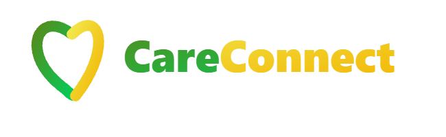

# Título do Projeto

`CURSO: Sistemas de Informação`

`DISCIPLINA: Projeto - Aplicações Web`

`SEMESTRE: 1º`

O projeto propõe a criação de uma plataforma digital que conecta ONGs, pessoas em situação de vulnerabilidade e potenciais doadores, facilitando a visibilidade dessas instituições e o acesso a contribuições. A proposta é reunir tudo em um único ambiente, tornando mais fácil encontrar quem precisa de ajuda e quem deseja contribuir.

O foco principal da solução é oferecer um meio prático para doações e proporcionar um ambiente acolhedor para os usuários, independentemente do seu nível de familiaridade com tecnologia. Além disso, a plataforma busca garantir uma experiência clara e confiável durante todo o processo.

## Integrantes

* Anna Sophia Lopes Peres 
* Lucas Daniel Nocce 
* Rafael Martins Lopes
* Rafael Souza Inácio 
* Yuri Christian da Silva Barbosa 

## Orientador

* Caroline Rhaian da Silva Jandre

# Planejamento

| Etapa         | Atividades |
|  :----:   | ----------- |
| ETAPA 1         |[Documentação de Contexto](docs/context.md)   [Especificação do Projeto](docs/especification.md) |
| ETAPA 2         |[Projeto de Interface](docs/interface.md)   [Template Padrão](docs/template.md) |
| ETAPA 3         |[Programação de Funcionalidades - HTML e CSS](docs/development.md) |
| ETAPA 4        |[Programação de Funcionalidades - Javascript](docs/development.md)   [Testes de Software ](docs/tests.md) |
| ETAPA 5         | [Apresentação](presentation/README.md) |

# Código

<li><a href="src/README.md"> Código Fonte</a></li>

# Apresentação

<li><a href="presentation/README.md"> Apresentação da solução</a></li>
