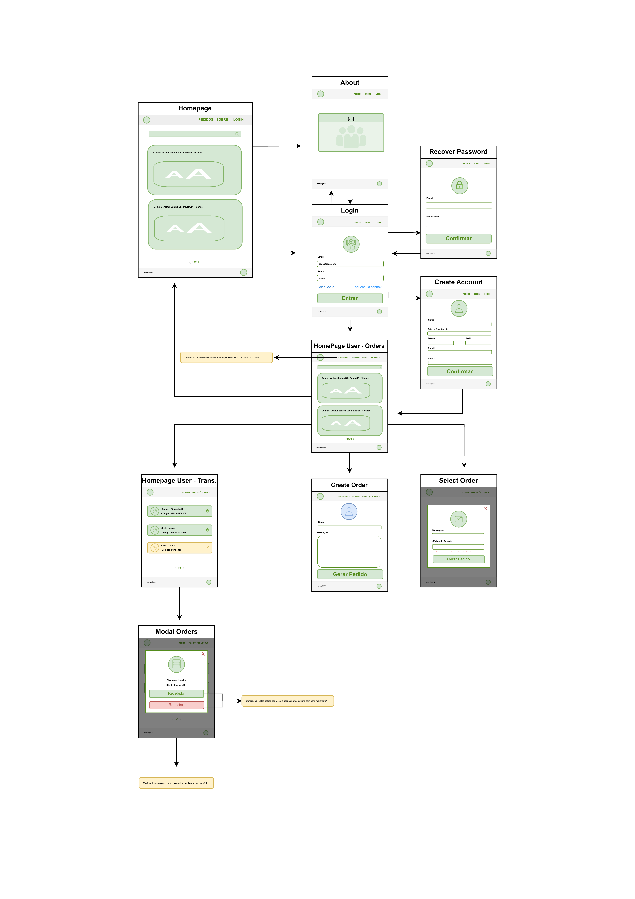
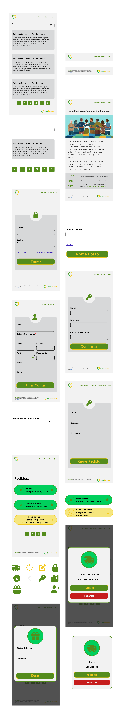

# Projeto de Interface

Durante o desenvolvimento da interface do projeto, a principal prioridade foi criar um design intuitivo e de fácil compreensão, independentemente do nível de conhecimento do usuário ou da sua familiaridade com o meio digital. As cores escolhidas utilizam conceitos de semiótica para transmitir sensações positivas, considerando que solicitar ajuda pode ser um momento de fragilidade, no qual qualquer sensação de acolhimento se torna relevante.

Com o objetivo de facilitar a navegação, optou-se por um menu com poucos itens, evitando confundir usuários com pouca experiência em websites. Dessa forma, priorizaram-se âncoras com textos diretos e intuitivos. 

Os requisitos funcionais RF-01 e RF-02 podem ser acessados pela página inicial, por meio da área de login, onde o usuário pode entrar com e-mail e senha, criar uma conta ou solicitar recuperação de senha (RF-09).

A criação de contas atende ao requisito RF-06, solicitando dados de validação como endereço, telefone ou CPF/CNPJ. 

Os requisitos RF-04 e RF-05 estão disponíveis na página inicial, que apresenta a lista de pedidos. Usuários não autenticados são redirecionados para o login ao interagir com um pedido, enquanto usuários autenticados do tipo “doador” podem reservá-lo. A página também conta com um filtro de busca por itens ou nomes de pedidos, conforme o RF-11.

Por fim, a seção de transações permite ao usuário acompanhar suas doações ou solicitações. Nessa área, usuários do tipo “solicitante” podem confirmar entregas ou reportar problemas, atendendo ao requisito RF-08.

## User Flow

O desenvolvimento do user flow foi realizado por meio do draw.io, devido à sua interface amigável e de fácil utilização. 

A página inicial da plataforma será composta pela lista de pedidos, com o objetivo de incentivar o cadastro de usuários a partir da identificação com as histórias apresentadas. Esses pedidos serão exibidos em formato de cards, contendo um título curto e informações não sensíveis, como nome, idade e localização (cidade/estado).

Usuários não autenticados poderão acessar a página inicial (pedidos), a página “Sobre”, que apresenta o propósito do projeto e a visão dos idealizadores, e a página de login. O acesso à conta será realizado de forma tradicional, utilizando e-mail e senha, proporcionando uma experiência familiar e sem dificuldades.

Após a autenticação, usuários do tipo “doador” poderão acessar a aba de pedidos e reservar solicitações de acordo com seu interesse. Cada reserva terá duração máxima de 7 dias e o pedido ficará temporariamente indisponível para outros usuários. Ao realizar a reserva, o doador poderá enviar uma mensagem ao solicitante, que poderá ser atualizada posteriormente ao inserir o código de rastreio do envio.

Usuários do tipo “solicitante” terão acesso exclusivo à funcionalidade de criação de pedidos, podendo definir um título objetivo e uma descrição detalhada da necessidade. 

Todos os usuários autenticados poderão acessar a seção de transações, onde será possível acompanhar o andamento dos pedidos. Nessa seção, a cor amarela indicará que o pedido está pendente do código de rastreio, enquanto a cor verde indicará que o envio já está em andamento.

Por fim, usuários do tipo “solicitante” terão acesso aos botões de confirmar ou reportar a entrega. Essa funcionalidade visa garantir o recebimento correto dos itens e aumentar a confiabilidade da plataforma. Doadores que forem reportados mais de cinco vezes por solicitantes diferentes poderão ser banidos do sistema.

## Wireframes

O projeto contará com 8 telas principais e 2 modais, totalizando cerca de 11 componentes, incluindo menu, rodapé, cards, botões e campos de texto. Entre as telas, 2 apresentarão variações de acordo com o perfil do usuário logado (doador ou solicitante).

Serão utilizados aproximadamente 10 ícones gratuitos provenientes do Font Awesome (https://fontawesome.com/) e uma imagem gerada pelo Gemini AI.

O menu do usuário não autenticado permitirá a navegação pelas seguintes seções:

* Pagina Inicial (Pedidos)
* Sobre
* Login

Já o menu do usuário autenticado variará conforme o perfil:

Solicitante:

* Criar Pedido
* Pedidos
* Transações
* Sair</a>

Doador:

* Pedidos
* Transações
* Sair</a>

Na seção de transações, será possível acompanhar o status dos pedidos. Caso o pedido já tenha sido enviado, ao clicar nele o usuário poderá acessar informações como a localização. Se o usuário for um solicitante, também terá a opção de confirmar a entrega ou reportar o pedido.

Se o pedido estiver pendente, o usuário classificado como doador deverá acessá-lo para abrir um modal de edição e inserir o código de rastreio em até 7 dias úteis. Caso contrário, perderá a reserva do pedido, que retornará à aba de pedidos do site. Por meio desse modal, também será possível enviar uma mensagem ao recebedor.

A cor amarela será utilizada para indicar pedidos pendentes, enquanto a cor verde representará pedidos em processo de entrega.

A página “Sobre” contará com dados atualizados em tempo real, com base nas estatísticas disponíveis na base de dados.

Para criar uma conta, o usuário deverá informar: nome, data de nascimento, cidade, estado, perfil (doador ou solicitante), documento (obrigatório apenas para ONGs, que deverão informar o CNPJ), e-mail e senha.

No cabeçalho (header), a logo (versão 1.1) ficará posicionada no extremo esquerdo, enquanto o menu estará localizado no lado direito.

No rodapé (footer), será utilizada a versão 1.0 da logo, posicionada no canto esquerdo. No lado direito, haverá uma mensagem destacando o propósito do projeto e reforçando que não há qualquer ganho financeiro por parte dos responsáveis pelo gerenciamento do CareConnect.

