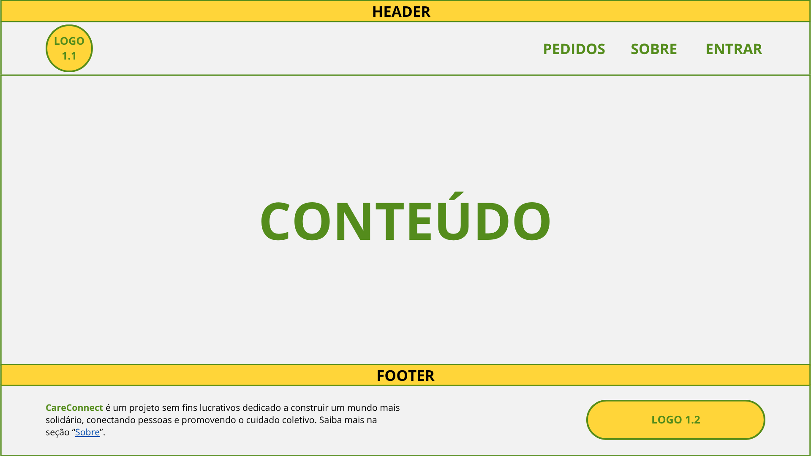
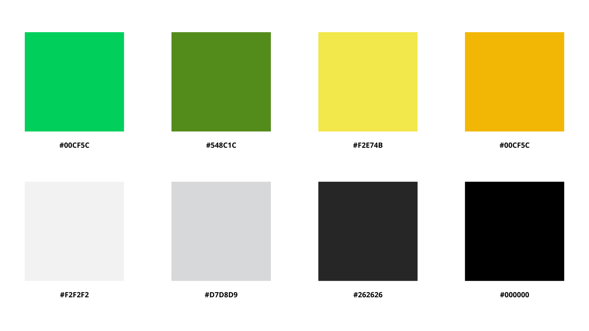
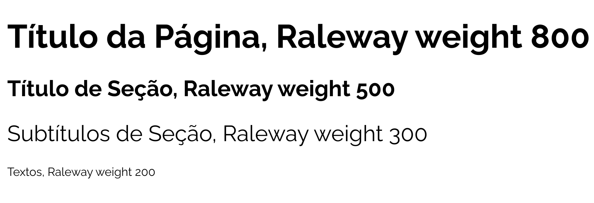
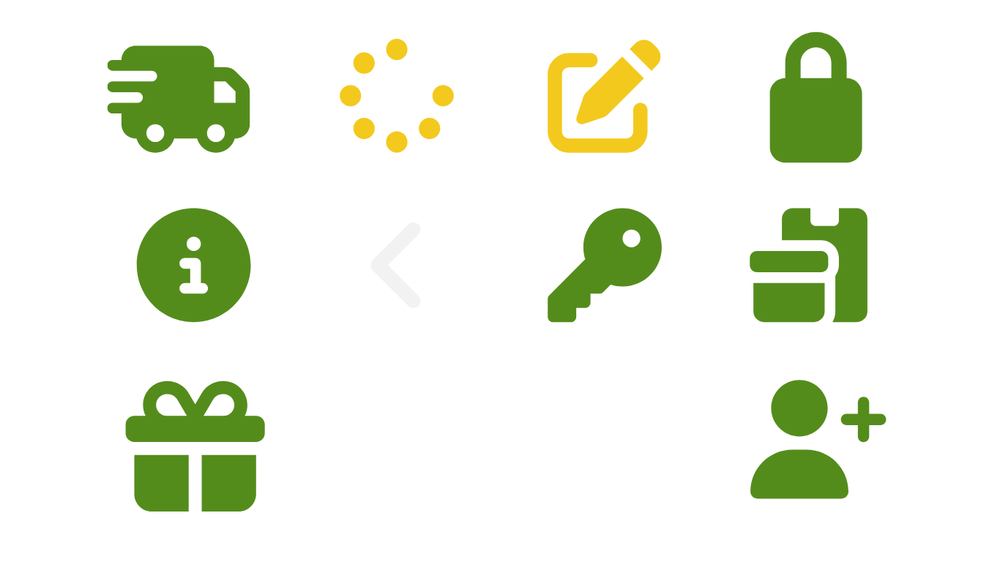

# Template padrão do site

O template do CareConnect seguirá diretrizes que priorizam a acessibilidade e a semiótica das cores, utilizando ícones descritivos e uma paleta equilibrada, com tons que não sejam excessivamente claros nem escuros. Essa escolha busca proporcionar uma experiência visual confortável, facilitando a navegação e evitando o cansaço visual dos usuários.

## Design

O layout padrão da página será composto por três seções principais: Header, Conteúdo e Footer.

No header, à esquerda estará a logo do projeto (versão 1.1) e, à direita, os itens do menu de navegação. 

* Para usuários não autenticados, o menu exibirá as opções: _Pedidos, Sobre e Entrar_. 
* Já para usuários autenticados, as opções serão: _Pedidos, Transações e Sair</a>_. 
* Caso o usuário autenticado seja do tipo “Solicitante”, será exibida também a opção _Criar Pedido_.

A seção de conteúdo apresentará as informações da página, seguindo as diretrizes visuais e de usabilidade definidas no design do projeto.

No footer, à direita haverá uma mensagem reforçando o propósito do projeto, acompanhada de um link para a página Sobre, que deixa de aparecer no menu após o login. À esquerda, será exibida novamente a logo do projeto (versão 1.0).

## Cores

A paleta de cores do projeto foi definida com base nas crenças dos criadores. Acreditamos que a situação de necessidade é passageira e que, hoje, quem precisa de ajuda pode, no futuro, ajudar outras pessoas.

Com esse propósito, optou-se pelo uso do verde como cor principal, por remeter à esperança, renovação, prosperidade e sorte, e do amarelo, que transmite positividade, acolhimento e energia. Além disso, a combinação dessas cores faz referência à bandeira do Brasil, reforçando a sensação de pertencimento e proximidade com o usuário.

A paleta de cores do projeto foi definida da seguinte forma: 

* A cor primária (#548C1C) será utilizada em botões e âncoras. 
* A cor secundária (#F2F2F2) será aplicada no background geral da página, incluindo header e footer. 
* Como alternativa para áreas que necessitem de destaque, poderá ser utilizada a cor #D7D8D9.
* Para os textos, será utilizada a cor #262626, enquanto os títulos serão apresentados em #000000. 
* Já os cards seguirão uma variação entre as cores #00CF5C e #F2E74B, com ajustes de opacidade conforme o contexto de uso.

## Tipografia

A tipografia do projeto será baseada na fonte Raleway, com variações de peso para hierarquia visual. 

* Para títulos de página, será utilizado weight 800. 
* Os títulos de seção utilizarão weight 500
* Os subtítulos de seção terão weight 300.
* Os textos em geral serão apresentados com weight 200.

## Iconografia

Para os ícones, serão utilizados recursos gratuitos disponibilizados pelo Font Awesome, por meio do site https://fontawesome.com/search. A escolha se deve à facilidade de uso, à compatibilidade com SVGs e à possibilidade de personalização de cores, permitindo alinhamento com a paleta definida para o projeto.

A imagem abaixo ilustra os itens que serão utilizados, bem como suas respectivas cores.

